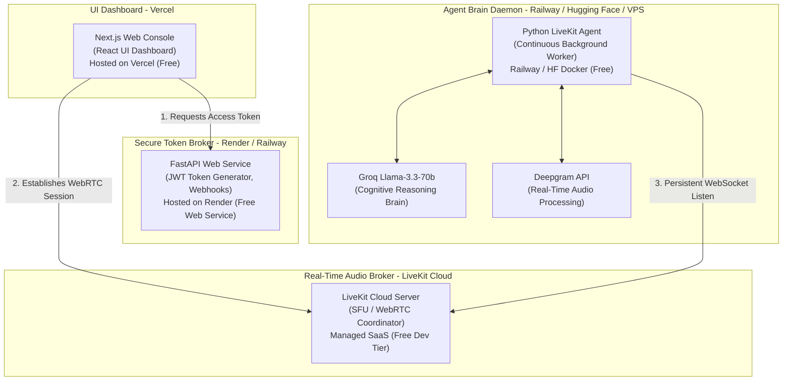

# 🌐 Vigilante AI - Production Deployment & Hosting Masterclass

Welcome to the production deployment guide for the **Vigilante AI Suite**. This document walks you through the step-by-step process of hosting a fully public, production-grade cloud deployment of the application. 

By deploying your project online, you will get a **live public URL** that you can place in your GitHub repository sidebar and submit to hackathon evaluators so they can test your voice agent directly from their own browser!

---

## 🏗️ Production Architecture & Tier Breakdown

Because Vigilante AI is a cutting-edge real-time agentic application, it uses a multi-tier architecture to handle audio streaming and LLM processing. To deploy it completely for free, we split the components across specialized platforms:



### Hosting Strategy Table

| Component | Platform | Service Type | Role | Cost | Why this platform? |
| :--- | :--- | :--- | :--- | :--- | :--- |
| **LiveKit Server** | **LiveKit Cloud** | Managed SaaS | WebRTC Audio Mixer & Room Broker | **$0** (Developer Tier) | Avoids manual STUN/TURN/UDP configuration and SSL setups. |
| **Frontend UI** | **Vercel** | Serverless Next.js | Modern dashboard & user interface console | **$0** (Hobby) | Native Next.js compiler, automatic global CDN, and free `https://` SSL. |
| **Backend API** | **Render** | Docker/Python Service | Token generation and third-party webhook targets | **$0** (Free Web Service) | Perfect for REST APIs. Excellent subfolder scoping support. |
| **Voice Agent** | **Hugging Face / Railway** | Continuous Daemon | Persistent Python background audio worker | **$0** (HF Spaces / Railway Trial) | **Crucial:** Background agents are websocket clients, NOT standard web servers. They cannot run on serverless (Vercel) and require a 24/7 runner. |

---

## 🔑 Phase 1: Setup Managed LiveKit Cloud (Free)

Self-hosting a WebRTC/SFU server requires configuring STUN/TURN servers, opening massive UDP port ranges, and installing SSL certificates. **LiveKit Cloud** provides a fully managed developer tier that handles all of this automatically.

1. Go to **[livekit.io](https://livekit.io/)** and click **Sign Up**.
2. Create a new project named `Vigilante-AI`.
3. Once the project is created, navigate to **Settings > Keys** in the LiveKit Cloud dashboard.
4. Copy the following credentials (you will need these for the backend, frontend, and voice agent):
   * **Project Connection URL** (looks like: `wss://vigilante-xxxxxx.livekit.cloud`)
   * **API Key** (looks like: `APIxxxxxxxxxxxx`)
   * **API Secret** (a long alphanumeric hash string)
5. Keep these credentials in a secure note; they will link all your hosted systems.

---

## 🚀 Phase 2: Host the FastAPI Backend (Render)

The FastAPI backend behaves as our secure token manager (dispensing JWT credentials so the frontend can securely join the LiveKit room) and processes webhooks.

### Step-by-Step Render Deployment:
1. Log in to **[Render.com](https://render.com/)** using your GitHub account.
2. In the dashboard, click the blue **New +** button in the top right and select **Web Service**.
3. Under **Connect a repository**, select your `guvihclhack26` repository.
4. On the configuration screen, configure the following values:
   * **Name**: `vigilante-backend`
   * **Region**: Select the region closest to you (e.g., `Oregon (US West)` or `Frankfurt (EU Central)`)
   * **Branch**: `main` (or whichever branch holds your code)
   * **Root Directory**: `DJ/guvihack-main/backend` *(This tells Render to build only your FastAPI backend subfolder, ignoring the Next.js frontend and Phase3 Voice folders).*
   * **Runtime**: Select `Python`
   * **Build Command**: `pip install -r requirements.txt`
   * **Start Command**: `uvicorn main:app --host 0.0.0.0 --port $PORT`
   * **Instance Type**: Select **Free**
5. Click the **Advanced** button at the bottom of the page to open the **Environment Variables** panel. Add the following keys:

| Environment Variable Key | Value Source | Purpose |
| :--- | :--- | :--- |
| `LIVEKIT_URL` | Your LiveKit Cloud Connection URL (`wss://...`) | API route broker pointer |
| `LIVEKIT_API_KEY` | Your LiveKit API Key | Generates WebRTC room JWTs |
| `LIVEKIT_API_SECRET` | Your LiveKit API Secret | Cryptographically signs JWTs |
| `GROQ_API_KEY` | Your Groq API Key (`gsk_...`) | Powering backend LLM logic |

6. Click **Deploy Web Service**.
7. Render will build the environment and deploy it (takes 2-3 minutes). 
8. **Copy your hosted backend URL** from the top left corner (e.g., `https://vigilante-backend.onrender.com`).

---

## 🌐 Phase 3: Host the Next.js Frontend Console (Vercel)

Modern web browsers enforce strict security policies regarding microphone access. **Microphones will be blocked on any non-secure (`http://`) URL.** Vercel solves this by automatically registering a secure `https://` domain for your application.

### Step-by-Step Vercel Deployment:
1. Log in to **[Vercel](https://vercel.com/)** using your GitHub account.
2. Click **Add New** and select **Project**.
3. Import your `guvihclhack26` repository.
4. In the **Project Settings** window:
   * **Project Name**: `vigilante-ai-console`
   * **Framework Preset**: Select **Next.js**
   * **Root Directory**: Click *Edit* and select **`DJ/guvihack-main/frontend`** *(This is extremely important! Vercel will compile and bundle only the Next.js frontend folder, ignoring the backend and agent folders).*
5. Scroll down to the **Environment Variables** section and add the API endpoint:
   * **Key**: `NEXT_PUBLIC_API_URL`
   * **Value**: `https://vigilante-backend.onrender.com` *(Paste the exact live URL of your Render backend from Phase 2).*
6. Click **Deploy**. Vercel will build your Next.js application and serve it via a global edge CDN in about 1-2 minutes.
7. Note down your live console URL (e.g., `https://vigilante-ai-console.vercel.app`).

---

## 🎙️ Phase 4: Host the LiveKit Voice Agent Worker

> [!IMPORTANT]
> The Voice Agent is an **autonomous client daemon**. It does not listen on an HTTP port; instead, it establishes a persistent WebSocket connection to the LiveKit server room and stays open 24/7, waiting for callers to join.
> Because of this, **it cannot be hosted on standard serverless architectures like Vercel or AWS Lambda.** It requires a running background process.

Here are the **three best ways** to host it, ranging from 100% free cloud hosting to self-hosting:

---

### Option A: Railway (Hobby Tier - Easiest Setup)
Railway provides a developer sandbox that supports persistent background processes with automated subfolder building.

1. Log in to **[Railway.app](https://railway.app/)** with your GitHub account.
2. Click **New Project** > **Deploy from GitHub repo** and select your repository.
3. Once imported, click on your newly created service card and go to **Settings**:
   * **Root Directory**: Set to `Phase3_Voice`
   * **Build Command**: `pip install -r requirements.txt`
   * **Start Command**: `python agent/agent.py start` *(Uses `start` instead of `dev` for production worker mode).*
4. Navigate to the **Variables** tab and click **New Variable** to add the required credentials:
   * `LIVEKIT_URL` = `wss://your-livekit-url.livekit.cloud`
   * `LIVEKIT_API_KEY` = `your-api-key`
   * `LIVEKIT_API_SECRET` = `your-api-secret`
   * `DEEPGRAM_API_KEY` = `your-deepgram-api-key`
   * `GROQ_API_KEY` = `your-groq-api-key`
   * `CARTESIA_API_KEY` = `your-cartesia-api-key` *(Optional - if using high-fidelity Cartesia voices)*
5. Click **Deploy**. Since no network port is bound, Railway will automatically flag this as a **Background Worker** and run it non-stop in the background!

---

### Option B: Hugging Face Spaces (100% Free 24/7 Cloud hosting)
If you want a **completely free** 24/7 background runner, you can deploy the voice agent to a Hugging Face Space using a Docker SDK configuration.

1. Go to **[Hugging Face](https://huggingface.co/)** and create a free account.
2. Click on your profile icon in the top right and select **New Space**.
3. Configure your space settings:
   * **Space Name**: `vigilante-voice-worker`
   * **License**: `mit`
   * **SDK**: Select **Docker** (very important!)
   * **Docker Template**: Select **Blank**
   * **Space Hardware**: CPU Basic (Free - runs 24/7 and is plenty fast!)
   * **Visibility**: Public (or Private if you want your code hidden)
4. Go to the **Settings** tab of your new Space, scroll down to **Variables and Secrets**, and click **New Secret** to add your credentials:
   * Add secrets for `LIVEKIT_URL`, `LIVEKIT_API_KEY`, `LIVEKIT_API_SECRET`, `DEEPGRAM_API_KEY`, and `GROQ_API_KEY`.
5. Under your local project, copy the `Dockerfile` from the backend or create a simple one in `Phase3_Voice` named `Dockerfile`:
   ```dockerfile
   FROM python:3.11-slim
   WORKDIR /app
   COPY requirements.txt .
   RUN pip install --no-cache-dir -r requirements.txt
   COPY . .
   CMD ["python", "agent/agent.py", "start"]
   ```
6. Push only the `Phase3_Voice` contents to your Hugging Face Space repo, or sync your GitHub repo with the Space. Once built, the Space will run the worker continuously in the background for **$0/month**!

---

### Option C: Self-Hosted Cloud VPS (AWS EC2 / Oracle Cloud / DigitalOcean)
If you have a Linux server (Ubuntu) and want absolute control with zero platform limits, you can host the agent as a system background service using `systemd`.

1. **SSH into your Linux server** and clone your repository:
   ```bash
   git clone https://github.com/your-username/guvihclhack26.git
   cd guvihclhack26/Phase3_Voice
   ```
2. **Setup a virtual environment and install dependencies**:
   ```bash
   python3 -m venv venv
   source venv/bin/activate
   pip install -r requirements.txt
   ```
3. **Configure Environment Variables**:
   Create a `.env` file inside `Phase3_Voice/`:
   ```bash
   nano .env
   ```
   Paste the following:
   ```env
   LIVEKIT_URL=wss://your-livekit-url.livekit.cloud
   LIVEKIT_API_KEY=your-api-key
   LIVEKIT_API_SECRET=your-api-secret
   DEEPGRAM_API_KEY=your-deepgram-api-key
   GROQ_API_KEY=your-groq-api-key
   ```
4. **Create a Systemd Service**:
   Open a new service configuration file:
   ```bash
   sudo nano /etc/systemd/system/vigilante-agent.service
   ```
   Paste the following configuration:
   ```ini
   [Unit]
   Description=Vigilante AI LiveKit Voice Agent Daemon
   After=network.target

   [Service]
   Type=simple
   User=ubuntu
   WorkingDirectory=/home/ubuntu/guvihclhack26/Phase3_Voice
   ExecStart=/home/ubuntu/guvihclhack26/Phase3_Voice/venv/bin/python agent/agent.py start
   Restart=always
   RestartSec=5
   EnvironmentFile=/home/ubuntu/guvihclhack26/Phase3_Voice/.env

   [Install]
   WantedBy=multi-user.target
   ```
5. **Start and Enable the Daemon**:
   ```bash
   # Reload systemd to load our new service config
   sudo systemctl daemon-reload

   # Enable the service so it starts automatically on system reboots
   sudo systemctl enable vigilante-agent.service

   # Start the service immediately
   sudo systemctl start vigilante-agent.service
   ```
6. **Monitor the Agent Logs in Real-time**:
   ```bash
   journalctl -u vigilante-agent.service -f -n 100
   ```

---

## 🔍 Verification & Diagnostics Checklist

To ensure all three hosted tiers are communicating perfectly, perform this end-to-end telemetry check:

1. **Verify FastAPI Backend**:
   * Open your browser and visit your hosted FastAPI URL (e.g. `https://vigilante-backend.onrender.com/`).
   * It should output: `{"status": "Vigilante AI Module 1 Operational", "mode": "Hackathon_Evaluation"}`.
2. **Open Frontend Console**:
   * Visit your secure Next.js Vercel URL (e.g. `https://vigilante-ai-console.vercel.app/console`).
   * Verify that the browser prompts you for **Microphone Permissions** and that you click **Allow**.
3. **Trigger WebRTC Neural Link**:
   * Click the **"Connect Neural Link"** button on your console.
   * *Under the hood:* The frontend calls `/token` on your Render backend to retrieve a signed WebRTC room JWT token, then initiates a secure connection to your LiveKit Cloud room.
4. **Speak to the Agent**:
   * Say *"Hello!"* into your microphone.
   * Your background Python Voice Agent (running on Railway/Hugging Face/VPS) will detect your audio stream, process the speech using Deepgram STT, formulate a scammer interception response using Groq LLM, synthesize the audio, and speak back to you!

---

## 📋 Hackathon Submission Template

When submitting your project on GitHub and the hackathon portal, you can use this structured format in your repository's `README.md` or submission report to highlight your live deployment:

```markdown
### 🌐 Live Production Deployment

Our application is fully hosted on cloud-native architecture. You can experience the real-time AI dashboard and voice agent without setting up any code locally!

*   💻 **Live Web Console**: [https://vigilante-ai-console.vercel.app](https://vigilante-ai-console.vercel.app) (Hosted on Vercel)
*   ⚙️ **API Gateway**: [https://vigilante-backend.onrender.com](https://vigilante-backend.onrender.com) (Hosted on Render)
*   🎙️ **Voice Agent SFU Broker**: LiveKit Cloud Managed SaaS
*   🧠 **Voice Agent Brain**: Python Daemon running on Railway Cloud Core

> 💡 **Testing Note**: Microphone access is fully supported via secure HTTPS. If testing the voice interface, please allow microphone access when prompted by Vercel!
```

---

## 🛠️ Troubleshooting Production Issues

### ❌ Problem: The agent doesn't speak back when I join the room
* **Reason 1**: The background Voice Agent process isn't running or failed to connect to LiveKit.
  * **Fix**: Check your Railway logs or run `journalctl -u vigilante-agent.service -f` on your VPS. Ensure the logs show `Agent joined room` and no `Connection Refused` errors.
* **Reason 2**: API credentials mismatch.
  * **Fix**: Double-check that the `LIVEKIT_URL`, `LIVEKIT_API_KEY`, and `LIVEKIT_API_SECRET` are **exactly identical** across all three platforms (Render backend, Railway voice agent, and LiveKit portal).

### ❌ Problem: CORS blocking errors in the browser console
* **Reason**: The frontend is attempting to fetch tokens from the backend but is blocked by CORS.
  * **Fix**: Ensure your FastAPI `main.py` has `allow_origins=["*"]` configured in the `CORSMiddleware` (which is standard and already enabled in our backend codebase).

### ❌ Problem: Microphone access is blocked
* **Reason**: Modern browsers block `navigator.mediaDevices.getUserMedia` on insecure connections.
  * **Fix**: Always access the frontend via its secure `https://` Vercel URL. Do not use local IP URLs or insecure HTTP web services.
