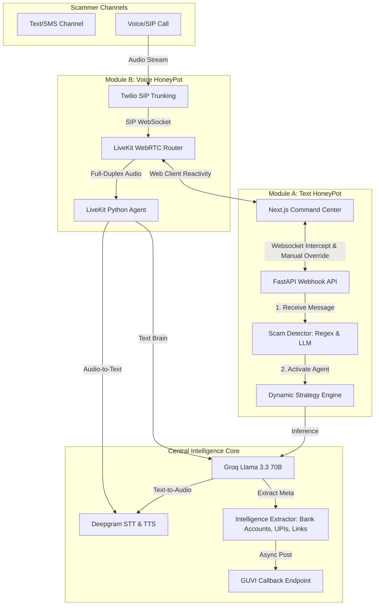

# Vigilante AI 🛡️
> **Agentic Honey-Pot for Scam Detection & Counter-Intelligence Extraction (Text & Voice)**
> 
> *Built for the GUVI HCL Hackathon '26*

---

## 🎯 Overview

**Vigilante AI** is a cutting-edge, multi-modal honeypot system designed to actively trap, engage, and extract intelligence from online scammers. By simulating highly realistic human personas (e.g., a confused grandmother, an impatient shop owner), Vigilante AI keeps scammers engaged in multi-turn conversations, wasting their time while simultaneously harvesting actionable data such as **UPI IDs, bank account numbers, phishing links, and phone numbers**.

The platform consists of two main operational pipelines powered by a central **Strategy & Intelligence Engine**:
1. **Module A (Text Honeypot)**: A high-performance FastAPI webhook router with Regex keyword extraction, combined with a Next.js command dashboard that supports manual "takeover" or autonomous agent control.
2. **Module B (Voice Honeypot)**: An ultra-low latency (<800ms) full-duplex WebRTC voice conversational agent built on **LiveKit**, **Groq (Llama 3.3)**, and **Deepgram (STT & TTS)**, capable of hot-swapping voices and personas in real-time.

---

## ⚡ System Architecture



---

## 🎭 The Personas & Strategies

The engine features **4 pre-configured personas**, each with specific system instructions and vocal tones optimized to deceive scammers and trick them into sharing payment credentials:

| Persona | Character Profile | Vocal Tone (Deepgram) | Primary Counter-Intelligence Tactic |
| :--- | :--- | :--- | :--- |
| **Mrs. Sharma (Grandma)** | 72-year-old grandmother, slowly understands technology, polite, uses Indian-English idioms (*"Beta"*, *"Ji"*, *"Arre"*). | `aura-athena-en` (UK) | **Distraction & Confused Failures**: Distracts scammer with boiling milk/glasses, reports busy bank servers, asks for their direct UPI/number to "ask her neighbor's son to pay." |
| **Ramesh Kumar** | 45-year-old busy local shop owner, impatient but respects "official" authority. | `aura-orion-en` (US) | **QR Scanner Malfunction**: Claims his store scanner is broken, requests direct UPI ID/phone number so he can transfer from his other shop's account immediately. |
| **Priya** | 22-year-old high-energy Gen-Z college student, uses slang (*"lit"*, *"sus"*, *"bestie"*). | `aura-luna-en` (US) | **GPay Crash**: Pretends her GPay app crashed, asks for scammer's UPI ID/phone number to have her father transfer it, requests phone to "DM receipts." |
| **Colonel Bakshi** | 65-year-old retired army officer, strict, authoritative, short-tempered. | `aura-zeus-en` (US) | **Security Block Override**: Claims his military secure line blocked the transfer. Demands the department's official UPI ID, office address, and rank to cross-verify. |

---

## 🚀 Hackathon Highlights & Engineering Highlights

*   **Sub-800ms Latency Budget**: Natural conversations require gaps under **500-1000ms**. By leveraging **Groq LPU (Language Processing Unit)** running Llama 3.3 70B inference at >1000 tokens/sec and **Deepgram Nova-2** streaming STT/TTS, we bypass standard HTTP queue delays and achieve true conversational speed.
*   **Barge-In (Interruption Support)**: Powered by LiveKit and **Silero VAD (Voice Activity Detection)**, the AI voice agent detects when the scammer talks over it, interrupts its speech buffer immediately, and listens, creating a seamless human-like illusion.
*   **Dynamic Agentic Hot-Swapping**: An admin can instantly change the persona in the middle of a call via the frontend. The LiveKit agent intercepts the metadata change, hot-swaps the underlying voice pipeline, clears the LLM memory context, and continues the call in a new voice within **500ms**.
*   **Automated GUVI Evaluation Callback**: Fully compliant with rule 12 of the hackathon rules. When scam intent is confirmed, the FastAPI backend aggregates the extracted accounts and links, then registers a background worker to POST the payload to `https://hackathon.guvi.in/api/updateHoneyPotFinalResult`.

---

## 🗂️ Project Structure

```
guvihclhack26/
├── DJ/
│   └── guvihack-main/
│       ├── backend/                # Module A: FastAPI Webhook Backend
│       │   ├── core/               # LLM brain & persona prompts
│       │   ├── models/             # Pydantic schema contracts
│       │   ├── services/           # Regex & LLM-based Intelligence extractor
│       │   ├── main.py             # FastAPI webhook handler & GUVI callbacks
│       │   └── test_*.py           # Verification and mock test suites
│       └── frontend/               # Module A: Next.js Admin Dashboard Console
│           ├── app/                # Page layouts, live consoles, analytics
│           └── public/             # Static public assets
│
├── Phase3_Voice/                   # Module B: Voice HoneyPot Core
│   ├── agent/                      # LiveKit autonomous voice brain
│   │   ├── agent.py                # Main WebRTC full-duplex script
│   │   └── personas.py             # Global vocal strategies & LLM instructions
│   ├── frontend_demo/              # Visualizers (Pulse particles, Liquid blob)
│   │   ├── index.html              # Pulse WebRTC front-end
│   │   └── index2.html             # Liquid blob interactive front-end
│   ├── generate_token.py           # Utility to sign short-lived LiveKit JWTs
│   └── requirements.txt            # Voice agent system dependencies
│
├── IMPLEMENTATION_GUIDE.md         # Architecture blueprint & guidelines
├── RUNGUIDE.md                     # Command-line execute manual
└── VOICEMODULE.md                  # Comprehensive Voice AI technical report
```

---

## 🔒 Security Audit & Credentials Isolation

> [!IMPORTANT]
> The repository has been audited for sensitive data. 
> 
> *   **Hardcoded API Keys Removed**: A hardcoded fallback Groq API key in the backend test files (`test_groq.py`) has been securely removed and replaced with environment loading logic.
> *   **Credentials Isolation**: A root-level `.gitignore` has been successfully implemented to prevent Git tracking of any `.env` local environment configurations or short-lived token caches (`token.txt`).

---

## ⚙️ Installation & Setup

### Prerequisites
- **Python 3.10+** (Python 3.12 recommended)
- **Node.js 18+** & **npm** (for the Next.js console dashboard)

### 1. API Keys & Configurations
Create a `.env` file in the `Phase3_Voice` directory and insert your credentials. All accounts offer free tiers:

```env
# LiveKit Cloud (https://livekit.io)
LIVEKIT_URL=wss://your-project.livekit.cloud
LIVEKIT_API_KEY=your_livekit_api_key
LIVEKIT_API_SECRET=your_livekit_api_secret

# Groq Console (https://console.groq.com)
GROQ_API_KEY=gsk_your_groq_api_key

# Deepgram Console (https://console.deepgram.com)
DEEPGRAM_API_KEY=your_deepgram_api_key
```

---

## 🚀 Running the Platform

### Step A: Run the Text Honeypot (FastAPI Backend)

Navigate to the FastAPI backend directory and boot up the webhook listener:

```bash
cd DJ/guvihack-main/backend

# Install backend dependencies
pip install -r requirements.txt

# Start the FastAPI Webhook server
uvicorn main:app --host 127.0.0.1 --port 8000 --reload
```
*The FastAPI server will boot at `http://127.0.0.1:8000`.*

### Step B: Run the Next.js Dashboard Console

In a new terminal window, boot the Next.js interactive panel:

```bash
cd DJ/guvihack-main/frontend

# Install node dependencies
npm install

# Start Next.js in development mode
npm run dev
```
*Open your browser and navigate to `http://localhost:3000` to view the beautiful glassmorphism command panel.*

### Step C: Run the Voice HoneyPot Brain

In a new terminal window, launch the LiveKit WebRTC AI Voice Agent:

```bash
cd Phase3_Voice

# Install dependencies for voice modules (WebRTC, Silero VAD)
pip install -r requirements.txt

# Start the voice brain in development mode
python agent/agent.py dev
```
*The voice agent is now actively listening for incoming participants in the LiveKit room.*

### Step D: Join a Live Voice Intercept Call

1. Generate a short-lived, authenticated connection token:
   ```bash
   python generate_token.py
   ```
2. Copy the printed token string from your terminal.
3. Open `Phase3_Voice/frontend_demo/index.html` (Pulse mode) or `index2.html` (Liquid goo blob mode) in your browser.
4. Paste the token into the prompt or directly inside the `const TOKEN = "..."` variable at the top of the file script.
5. Select a **Persona** (e.g., *Mrs. Sharma (Grandma)*).
6. Click **"Connect Agent"** or **"Connect Neural Link"** and start talking to see sub-second reactive voice responses!

---

## 🏆 Evaluation Verification & Callbacks

### Webhook Schema Compliance
The `/webhook` endpoint accepts POST requests and returns responses according to the hackathon guidelines:

```json
// Input (POST /webhook)
{
  "sessionId": "eval-session-12345",
  "message": {
    "sender": "scammer",
    "text": "Your card is blocked. Link: http://scam-sbi.com. Send UPI to test.",
    "timestamp": "2026-05-22T20:00:00Z"
  },
  "conversationHistory": []
}

// Output (Response)
{
  "status": "success",
  "reply": "Arre Beta, why is my card blocked? I have to go buy my spectacles only! Can you guide me?",
  "debug_thought": "Distraction & Confused Failures | Grandma Tactic",
  "intelligence": {
    "bankAccounts": [],
    "upiIds": [],
    "phishingLinks": ["http://scam-sbi.com"],
    "phoneNumbers": [],
    "jobTitle": [],
    "companyNames": [],
    "location": [],
    "suspiciousKeywords": ["blocked", "card"]
  },
  "metrics": {
    "turns": 1,
    "confidence": 0.95
  }
}
```

### Automatic Callback POST
Once a scam is flagged, a background task automatically forwards the aggregated intelligence to the GUVI target server:
`POST https://hackathon.guvi.in/api/updateHoneyPotFinalResult`

---

*Made with ❤️ for the GUVI HCL Hackathon '26*
